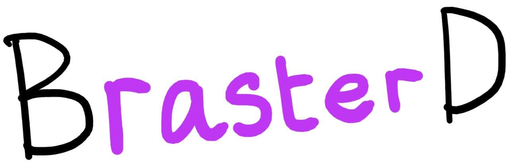
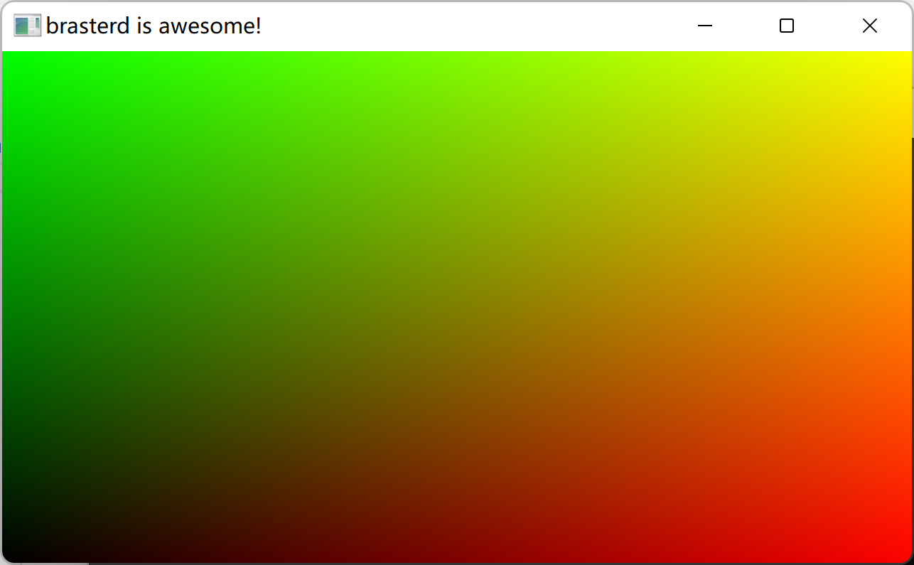
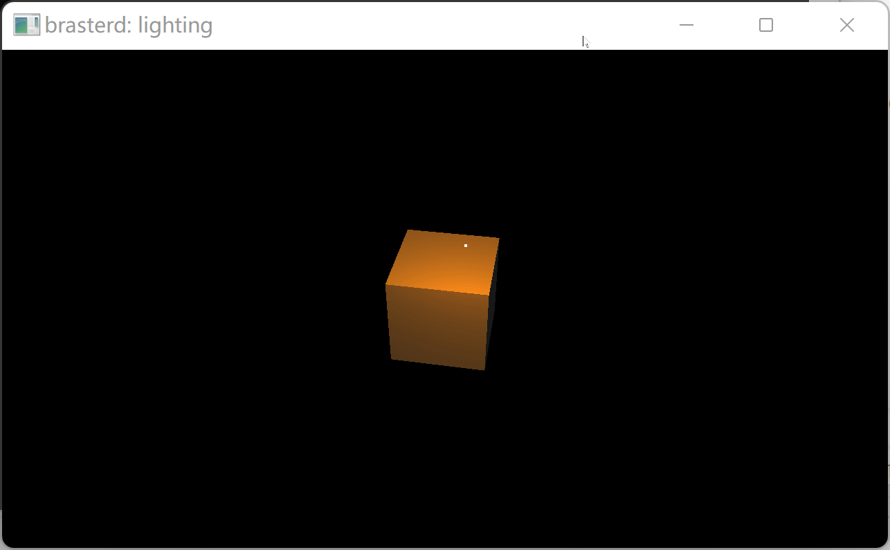
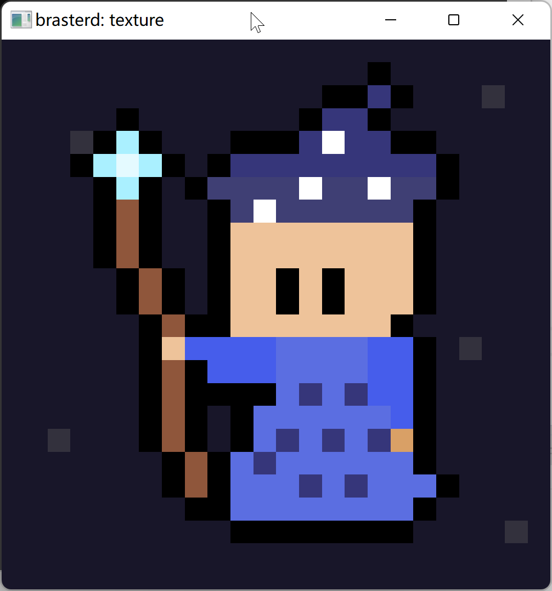
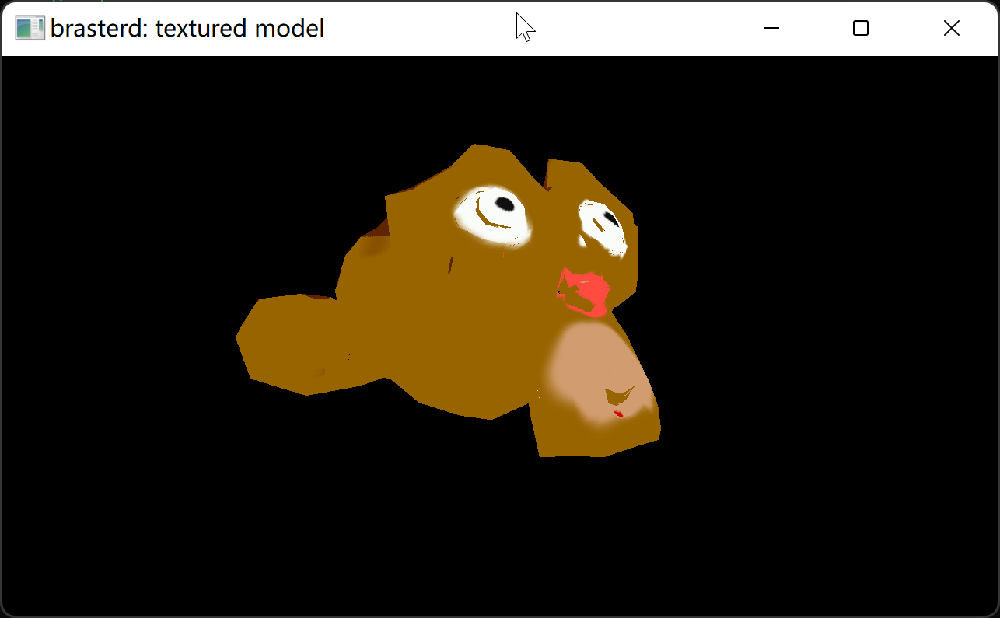

## brasterd

Not to be confused with [bastard](https://en.wiktionary.org/wiki/bastard), which is a bad word.

## Introduction

Brasterd is a software rasterizer currently I am currently working on.

It's not done yet, but if you want to build it anyways, go ahead! You will need [glad](https://glad.dav1d.de/), [glfw](https://www.glfw.org/), [stb_image](https://github.com/nothings/stb) & [glm](https://github.com/g-truc/glm). And to build example 07, you will also need [tinyobjloader](https://github.com/tinyobjloader/tinyobjloader).

## Showcase

- Initial screenshot

- Phong lighting (~10fps)

- Texture sampling

- 3D model & texture (~2fps)

(That's how the actual model looks like, by the way. It's not a rendering artifact, I just sucks at Blender.)

## The framerate is terrible!

It is, that's because it's a _software_ renderer. Maybe I will add some kind of concurrency in the future, but it is not my major concern now. There's still a lot to be done, for example framebuffer & alpha compositing.

